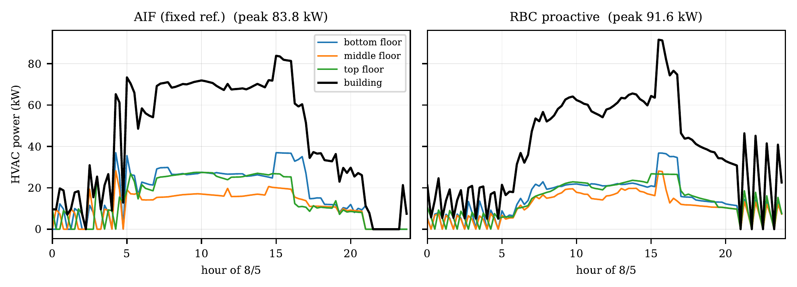
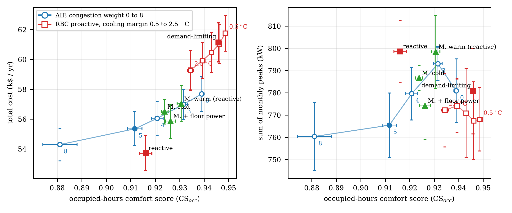

# One Agent per Zone: Decentralised Active Inference for Multi-Zone HVAC Control

Code, configurations and results for the paper *One Agent per Zone:
Decentralised Active Inference under Partial Observability for Multi-Zone HVAC
Control on Edge Hardware* (P. Kasnesis, L. Toumanidis, C. Chatzigeorgiou,
A. Contiero Syropoulou, M. De Prado).

Each of the 15 conditioned zones of the ASHRAE 90.1 OfficeMedium prototype is
controlled by an independent active-inference (AIF) agent. The agents exchange
no messages; each one reads the metered power of the other two air loops as a
congestion signal. The repository contains the agents, the rule-based and
MADDPG baselines, the experiment runner, and the scripts that produce every
table and figure of the paper.

## Main result

<p align="center">
  
</p>
<p align="center"><em>HVAC power per floor on 5 August. Under the proactive RBC (right) all
three floors ramp up together and the building peaks at 91.6 kW; under the AIF
fleet (left) the middle floor holds back when the bottom floor rises, and the
peak stays at 83.8 kW.</em></p>

Results on five noisy weather years that no controller saw during training
(mean over years; lower is better except for comfort):

| Controller | Peak (kW) | Coincidence factor | Comfort CS<sub>occ</sub> | Energy (MWh) | Cost (k$) |
|---|---|---|---|---|---|
| AIF (fixed reference) | **88.3** | **0.929** | 0.912 | 117.4 | 55.4 |
| RBC reactive | 93.8 | 0.974 | 0.916 | **106.2** | **53.7** |
| RBC proactive | 90.9 | 0.958 | **0.946** | 139.2 | 61.1 |
| RBC demand-limiting | 97.2 | 0.983 | **0.946** | 138.0 | 61.2 |
| MADDPG cold start | 106.0 | 0.994 | 0.924 | 120.3 | 56.5 |
| MADDPG + floor meters | 97.0 | 0.936 | 0.926 | 119.6 | 55.9 |

Key findings:

* **Lowest peak and coincidence factor.** The AIF fleet has the lowest mean
  annual peak and the lowest coincidence factor of all controllers. Its peak
  is lower than that of the reactive RBC and of every MADDPG fleet in each of
  the five test years.
* **Energy for demand.** At similar comfort to the reactive RBC, the AIF fleet
  lowers the sum of monthly peaks by 33 kW in every year but uses about 10 %
  more energy. Under the evaluated tariff ($26 per kW-month) this costs $1.6k
  more per year; the break-even demand charge is about $75 per kW-month.
* **The mechanism is a live load signal.** Ablations show that the
  coordination needs a real-time congestion signal combined with agents that
  weigh energy differently. A constant or a 24-hour-old signal does not work,
  and a MADDPG fleet given the same floor meters improves for the same reason.
* **Limitations.** A well-tuned proactive RBC remains the most comfortable
  controller, and in a hot climate the frozen AIF fleet loses considerable
  comfort.

<p align="center">
  
</p>
<p align="center"><em>Comfort against cost (left) and against the sum of monthly peaks (right)
on the noisy test years. Blue: AIF with congestion weights 0 to 8; red: the
proactive RBC with cooling margins 0.5 to 2.5 &deg;C; green: MADDPG fleets.</em></p>

## Repository layout

```
code/
  aif_agent.py            AIF agents (batched PyTorch) + simulation runner
  register_env.py         Sinergym environment (per-zone setpoints, floor meters, weather noise)
  metrics_utils.py        shared scoring: comfort, deadband, CF, tariff cost, MADDPG reward
  proactive_rbc.py        proactive rule-based controller
  rbc_office_reactive.py  reactive rule-based controller (same code base, two switches)
  rbc_v2.py               RBC runner, demand-limiting RBC, shared evaluation loop
  maddpg_v4.py            MADDPG/TD3 as trained for the cold and warm-start fleets
  maddpg_v5.py            same, plus --floor-features and self-contained checkpoints
  maddpg_eval.py          deterministic MADDPG evaluation under the same protocol
  run_ablation_v4.py      experiment runner: all suites, reports, robustness table
  paired_stats.py         per-year paired comparisons (Table II)
  make_figures.py         figures and LaTeX tables from the result files
  preflight.py            checks on the real environment before running
  tests/                  regression tests (no EnergyPlus needed)
building/                 custom epJSON model (see building/README.md)
scripts/                  install_building.py, reproduce_all.sh, collect_results.py
results/                  per-run results.json, summary CSVs, MADDPG training curves
figures/                  generated figures
paper/                    LaTeX source, bibliography and figures
env/                      software versions used for the paper
```

## Setup

The results in the paper were produced with Python 3.12.7, Sinergym 3.11.0,
EnergyPlus 24.1.0, PyTorch 2.7.1 (CUDA 12.6) on an NVIDIA RTX 3090
(`env/env_info.txt`; the exact package list is in `env/requirements-lock.txt`).

1. Install EnergyPlus 24.1.0 and Sinergym 3.11.0 following the Sinergym
   documentation, then the remaining packages:

       pip install -r requirements.txt

2. Install the custom building model into Sinergym:

       python scripts/install_building.py

3. Check the installation (about 15 minutes):

       cd code
       python tests/test_agent.py
       python tests/test_runner.py
       python preflight.py --legacy

## Reproducing the results

`scripts/reproduce_all.sh` runs every experiment in order, with the exact
settings used for the paper, then builds the tables and figures and copies the
result files into `results/`. All steps are resumable, so the script can be
interrupted and restarted. On one RTX 3090 the AIF and RBC experiments take
about 10 hours with three parallel jobs, and each MADDPG fleet takes about two
days to train.

To regenerate the tables and figures from the stored results without running
any simulation, see `results/README.md`.

### Where each result comes from

| Paper | Runner suites | Output |
|---|---|---|
| Table I, Table II, Fig. 1 (noisy years W1) | `transfer`, `rbc_transfer`, `maddpg_transfer` | `results/robustness.csv`, `paired_stats.py` |
| Table III (deterministic year W0) | `core`, `alt`, `rbc`, `maddpg` | `results/results.csv` |
| Table IV (unseen climates W2) | `transfer`, `rbc_transfer`, `maddpg_transfer` | `results/robustness.csv` |
| Table V (ablations, mechanism) | `core`, `sweep`, `horizon`, `alt`, `mechanism`, `followup` | `results/results.csv` |
| Fig. 2 (design day) | `alt_fixedref`, `rbc_proactive` | `make_figures.py` |
| Fig. 3 (tariff) | W1 runs | `make_figures.py` |

## Trained models

The trained models are attached to the
[v1.0 release](https://github.com/waldiez/aif-sinergym/releases/tag/v1.0)
as `aif-sinergym-models-v1.zip` (82 MB). Unzip it in the repository root:

```
models/
  aif_fixed_ref/checkpoint.pkl        AIF (fixed reference), the main configuration
  aif_running_ref/checkpoint.pkl      AIF (running reference)
  maddpg_cold/                        MADDPG, cold start           (model.pt, normalizer.npz, metadata.json)
  maddpg_warm_reactive/               MADDPG, reactive-RBC warm start
  maddpg_cold_floor/                  MADDPG with floor meters (32 input features)
```

The AIF checkpoints contain the learned transition models, energy weights and
congestion reference after five adaptation years on the deterministic year.
The MADDPG folders contain the actor and critic weights and the observation
normaliser; the replay buffers are not included.

To evaluate a model on one noisy test year (here seed 1) with learning
switched off, from the `code/` folder:

```bash
# AIF (fixed reference)
python aif_agent.py --mode zone --structural --weather mixed --episodes 1 \
  --energy_weight 0.2 --deadband_weight 8.0 --policy_len 8 --horizon_ref 8 \
  --floor_power_idx 92,93,94 --floor_power_scale 0.0011111 \
  --action_temp 0 --tou_weight 0 --learn_C --c_lr 0.02 --energy_w_min 0 --energy_w_max 1.0 \
  --congestion_weight 5 --cong_ref_W 92400 \
  --load ../models/aif_fixed_ref/checkpoint.pkl --freeze_all \
  --weather_variability 1.5 --seed 1 --out_dir ../runs/aif_fixed_ref_s1

# MADDPG (the 29- or 32-feature version is detected automatically)
python maddpg_eval.py --checkpoint_dir ../models/maddpg_cold_floor \
  --weather mixed --weather_variability 1.5 --seed 1 --out_dir ../runs/maddpg_floor_s1
```

For the running-reference AIF model, use `aif_running_ref` and drop
`--cong_ref_W 92400`; the reference is restored from the checkpoint. Use
`--weather hot` or `--weather cool` (without `--weather_variability`) for the
unseen climates. Each run writes a `results.json` with the same metrics as the
files in `results/`.

## Notes on reproducibility

* All runs are deterministic: the AIF agents select actions by argmax and the
  weather is either the fixed TMY3 year or seeded noise. Rerunning a
  configuration gives the same result on the same hardware.
* AIF runs on the GPU in float32 by default. Running on a CPU, or in float64,
  can change near-tied decisions; keep all runs of a comparison on the same
  device.
* The noisy weather of a given seed is identical for every controller; the
  report checks this by comparing the logged outdoor temperatures.
* `code/tests/aif_agent_v14_reference.py` is the earlier version of the agent.
  `aif_agent.py --legacy_infer --horizon_ref 0` reproduces it exactly, which the
  tests and `preflight.py --legacy` verify.

## Citation

If you use this code or the results, please cite:

```bibtex
@inproceedings{kasnesis2026oneagent,
  title     = {One Agent per Zone: Decentralised Active Inference under Partial
               Observability for Multi-Zone {HVAC} Control on Edge Hardware},
  author    = {Kasnesis, Panagiotis and Toumanidis, Lazaros and Chatzigeorgiou, Christos
               and Contiero Syropoulou, Amalia and De Prado, Miguel},
  booktitle = {TO BE UPDATED},
  year      = {2026}
}
```

## License

Apache License 2.0.

## Acknowledgment

This work was carried out in the SYNAPSE project, funded through the third open
call of dAIEDGE, the European Network of Excellence for distributed,
trustworthy, efficient and scalable AI at the Edge.
